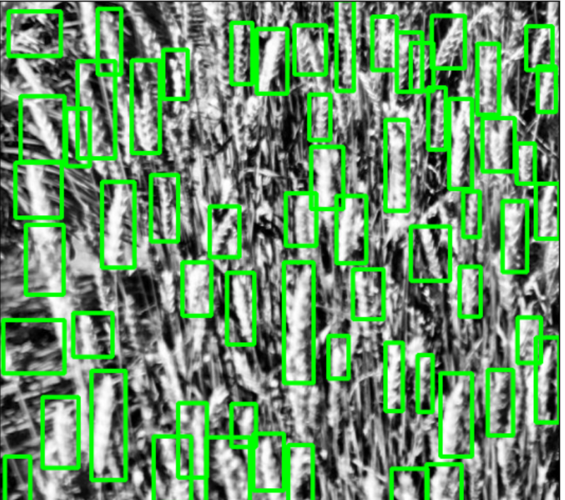

**MODEL TRAINING WITH FASTER R-CNN**
This project trains an object detection model using **Faster R-CNN** with a ResNet-50 backbone on a custom dataset. The model leverages PyTorch and Torchvision for training and evaluation.

---

**FEATURES**
- Uses **Faster R-CNN (ResNet-50 FPN)** from Torchvision
- Custom dataset support with bounding boxes
- Data loading with **PyTorch Dataset & DataLoader**
- Visualization of predictions with **Matplotlib**
- Image preprocessing with **OpenCV (cv2)**

---

**REQUIREMENTS**
All dependencies are listed in `requirements.txt`.  
Install them using:
bash
pip install -r requirements.txt

**INSTALLATION**
Clone the repository:

bash
git clone https://github.com/your-username/your-repo-name.git
cd your-repo-name

Create a virtual environment (recommended):
bash
python -m venv venv

On Windows
venv\Scripts\activate
Install dependencies:

bash
pip install -r requirements.txt

Training the Model
python train.py

If running the train2.py change it to the ipynb and run it in google collab
python train2.py

**PROJECT STRUCTURE**
```text
project-root/
├── data/                 (Dataset folder: images, annotations)
├── models/               (Saved / trained models)
├── notebooks/            (Jupyter notebooks for exploration & visualization)
├── src/                  (Source code)
│   ├── dataset.py        (Custom Dataset class)
│   ├── train.py          (Training script)
│   ├── test.py           (Testing / inference script)
│   └── utils.py          (Helper functions)
├── requirements.txt      (Python dependencies)
└── README.md             (Project documentation)
```

**TECHNOLOGIES USED**
Python 3.10+
PyTorch
Torchvision
OpenCV
Matplotlib
Pandas & NumPy

**LICENSE**
This project is licensed under the MIT License.

Result should look like this 





